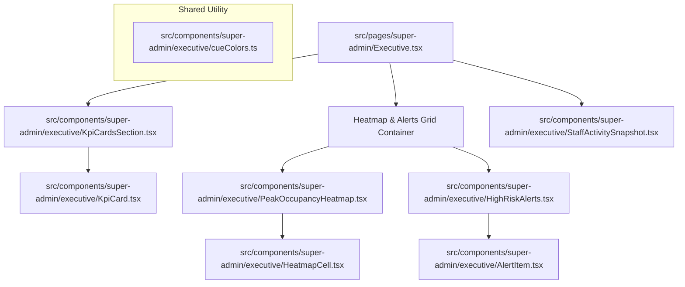

# Main Canvas Component Map and Generation Plan

This document details the modular layout and styling plan to implement the **Main Canvas** content of the **Executive Dashboard** as child views/components inside the existing super admin layout system.

---

## 1. Overview and Design Constraints
As requested, we will focus **strictly** on the Main Canvas, keeping the layout independent of the global navigation (which is already configured in [SuperAdminLayout.tsx](file:///B:/Kwadro_v2/frontend/src/layouts/SuperAdminLayout.tsx) and [Sidebar.tsx](file:///B:/Kwadro_v2/frontend/src/components/ui/navigations/Sidebar.tsx)). 

Our goals are:
- **Zero modification to layout wraps**: Seamlessly render inside the `<Outlet />` of `SuperAdminLayout`.
- **MUI v7 Conventions**: Use MUI `@mui/material` components, `sx` styling object API, and grid components (`Grid` with the `size` prop).
- **Aesthetics & Cyber-Grid Look**: Maintain the high-contrast dark cyberpunk theme from [executive_tab.md](file:///B:/Kwadro_v2/frontend/design-templates/executive_tab.md).
- **Granular Modularity**: Break down the dashboard into small, decoupled sub-components rather than a monolithic view.

---

## 2. Component Architecture Map



---

## 3. Style Guidelines (MUI Alignment)
- **Palette**: We will extract the cyberpunk palette into a dedicated `cueColors.ts` configuration, ensuring all sub-components share color tokens without polluting the global theme.
- **Typography**:
  - `fontFamily: "Inter, sans-serif"` for general copy, headings, and numerical values.
  - `fontFamily: '"JetBrains Mono", monospace'` for KPI titles, log outputs, labels, and metadata.
- **Scrollbars**: Apply standard dark-mode scrollbars using custom `sx` rules:
  ```typescript
  '&::-webkit-scrollbar': { width: '4px', height: '4px' },
  '&::-webkit-scrollbar-track': { background: cueColors.background },
  '&::-webkit-scrollbar-thumb': { background: '#2E2E2E' }
  ```
- **Grid Layout**: Leverage the modern responsive layout syntax of MUI:
  ```typescript
  import { Grid } from '@mui/material';
  // Example for 4-column row:
  <Grid item size={{ xs: 12, sm: 6, lg: 3 }}>...</Grid>
  ```

---

## 4. Detailed File Generation Plan

### File 1: [cueColors.ts](file:///B:/Kwadro_v2/frontend/src/components/super-admin/executive/cueColors.ts)
A configuration containing the color hex variables to match the dark futuristic look.

```typescript
export const cueColors = {
  background: '#121414',
  surface: '#121414',
  surfaceDim: '#121414',
  surfaceContainer: '#1f2020',
  surfaceContainerLow: '#1b1c1c',
  surfaceContainerLowest: '#0d0e0f',
  surfaceContainerHigh: '#292a2a',
  surfaceContainerHighest: '#343535',
  surfaceBright: '#383939',
  surfaceVariant: '#343535',
  primary: '#ffffff',
  onPrimary: '#2f3131',
  primaryContainer: '#e2e2e2',
  onPrimaryContainer: '#636565',
  secondary: '#c8c6c5',
  onSecondary: '#313030',
  secondaryContainer: '#474746',
  onSecondaryContainer: '#b7b5b4',
  tertiary: '#ffffff',
  onTertiary: '#303030',
  tertiaryContainer: '#e4e2e1',
  onTertiaryContainer: '#656464',
  error: '#ffb4ab',
  onError: '#690005',
  errorContainer: '#93000a',
  onErrorContainer: '#ffdad6',
  outline: '#8e9192',
  outlineVariant: '#444748',
  onSurface: '#e3e2e2',
  onSurfaceVariant: '#c4c7c8',
  inverseSurface: '#e3e2e2',
  inverseOnSurface: '#303031',
  inversePrimary: '#5d5f5f',
};
```

---

### File 2: [KpiCard.tsx](file:///B:/Kwadro_v2/frontend/src/components/super-admin/executive/KpiCard.tsx)
Displays total revenue, conversion rate, health score, or alert status with a dark bar representation.

```typescript
import { Box, Typography } from '@mui/material';
import { cueColors } from './cueColors';

export interface KpiCardProps {
  title: string;
  value: string;
  indicatorText: string;
  percentageFilled: number; // 0 to 100
  isErrorColor?: boolean;
}

export default function KpiCard({
  title,
  value,
  indicatorText,
  percentageFilled,
  isErrorColor = false,
}: KpiCardProps) {
  const highlightColor = isErrorColor ? cueColors.error : '#22c55e';
  const progressBg = isErrorColor ? 'rgba(255, 180, 171, 0.2)' : 'rgba(34, 197, 94, 0.2)';

  return (
    <Box
      sx={{
        backgroundColor: cueColors.surfaceContainer,
        p: '16px',
        border: `1px solid ${cueColors.outlineVariant}`,
        display: 'flex',
        flexDirection: 'column',
        height: '100%',
      }}
    >
      <Typography
        sx={{
          fontFamily: '"JetBrains Mono", monospace',
          fontSize: '11px',
          fontWeight: 500,
          color: cueColors.onSurfaceVariant,
          opacity: 0.7,
          mb: '8px',
          textTransform: 'uppercase',
        }}
      >
        {title}
      </Typography>
      <Typography
        sx={{
          fontFamily: 'Inter, sans-serif',
          fontSize: '32px',
          fontWeight: 700,
          letterSpacing: '-0.02em',
          mb: '4px',
          color: isErrorColor ? cueColors.error : cueColors.primary,
        }}
      >
        {value}
      </Typography>
      <Box sx={{ display: 'flex', alignItems: 'center', gap: '8px' }}>
        <Typography
          sx={{
            color: highlightColor,
            fontFamily: '"JetBrains Mono", monospace',
            fontSize: '10px',
            fontWeight: 500,
            whiteSpace: 'nowrap',
          }}
        >
          {indicatorText}
        </Typography>
        <Box
          sx={{
            height: '20px',
            flex: 1,
            backgroundColor: cueColors.surfaceDim,
            position: 'relative',
            overflow: 'hidden',
          }}
        >
          <Box
            sx={{
              position: 'absolute',
              top: 0,
              bottom: 0,
              left: 0,
              backgroundColor: progressBg,
              width: `${percentageFilled}%`,
            }}
          />
        </Box>
      </Box>
    </Box>
  );
}
```

---

### File 3: [KpiCardsSection.tsx](file:///B:/Kwadro_v2/frontend/src/components/super-admin/executive/KpiCardsSection.tsx)
Grids the cards responsively together.

```typescript
import { Grid } from '@mui/material';
import KpiCard from './KpiCard';

export default function KpiCardsSection() {
  const kpis = [
    { title: 'TOTAL REVENUE', value: '$284.5K', indicatorText: '+14.2%', percentageFilled: 75 },
    { title: 'RESERVATION CONV RATE', value: '68.4%', indicatorText: '+2.1%', percentageFilled: 66.6 },
    { title: 'SYSTEM HEALTH', value: '99.98', indicatorText: 'OPTIMAL', percentageFilled: 100 },
    { title: 'FAILED PAYMENTS', value: '12', indicatorText: '+4 CRITICAL', percentageFilled: 25, isErrorColor: true },
  ];

  return (
    <Grid container spacing={2} sx={{ mb: '16px' }}>
      {kpis.map((kpi, idx) => (
        <Grid key={idx} size={{ xs: 12, sm: 6, lg: 3 }}>
          <KpiCard {...kpi} />
        </Grid>
      ))}
    </Grid>
  );
}
```

---

### File 4: [HeatmapCell.tsx](file:///B:/Kwadro_v2/frontend/src/components/super-admin/executive/HeatmapCell.tsx)
Individually renders interactive, hoverable cells utilizing standard Material UI tooltips.

```typescript
import { Box, Tooltip } from '@mui/material';

interface HeatmapCellProps {
  dayName: string;
  hour: number;
  opacity: number;
}

export default function HeatmapCell({ dayName, hour, opacity }: HeatmapCellProps) {
  const loadPercentage = Math.round(opacity * 100);

  return (
    <Tooltip
      title={`Day: ${dayName}, Hour: ${hour}h | Load: ${loadPercentage}%`}
      arrow
      enterTouchDelay={0}
      leaveTouchDelay={1000}
    >
      <Box
        sx={{
          height: '24px',
          backgroundColor: '#ffffff',
          opacity: opacity,
          transition: 'opacity 0.15s',
          cursor: 'crosshair',
          '&:hover': {
            outline: '1px solid #ffffff',
            zIndex: 10,
          },
        }}
      />
    </Tooltip>
  );
}
```

---

### File 5: [PeakOccupancyHeatmap.tsx](file:///B:/Kwadro_v2/frontend/src/components/super-admin/executive/PeakOccupancyHeatmap.tsx)
Creates the 7x24 grid layout with titles, hour metrics on top, legend indicators, and Day grids.

```typescript
import { Box, Typography } from '@mui/material';
import { cueColors } from './cueColors';
import HeatmapCell from './HeatmapCell';

// Generate mock density opacities for 7 days * 24 hours
const DAYS = ['MON', 'TUE', 'WED', 'THU', 'FRI', 'SAT', 'SUN'];
const DAYS_FULL = ['Monday', 'Tuesday', 'Wednesday', 'Thursday', 'Friday', 'Saturday', 'Sunday'];

// Deterministic mock opacity grid (seeded for consistency)
const heatmapData: number[][] = DAYS.map((_, dayIdx) =>
  Array.from({ length: 24 }).map((_, hourIdx) => {
    // Generate a pseudo-random value between 0.1 and 1.0 based on day and hour indexes
    const factor = Math.sin(dayIdx + hourIdx * 0.5) * 0.45 + 0.55;
    return Math.max(0.05, Math.min(1.0, parseFloat(factor.toFixed(2))));
  })
);

export default function PeakOccupancyHeatmap() {
  return (
    <Box
      sx={{
        backgroundColor: cueColors.surfaceContainer,
        border: `1px solid ${cueColors.outlineVariant}`,
        p: '24px',
        height: '100%',
      }}
    >
      {/* Heatmap Title & Legend Bar */}
      <Box
        sx={{
          display: 'flex',
          flexDirection: { xs: 'column', sm: 'row' },
          justifyContent: 'space-between',
          alignItems: { xs: 'flex-start', sm: 'flex-end' },
          gap: 2,
          mb: '24px',
        }}
      >
        <Box>
          <Typography
            sx={{
              fontFamily: '"JetBrains Mono", monospace',
              fontSize: '11px',
              letterSpacing: '0.05em',
              fontWeight: 'bold',
              color: cueColors.onSurface,
              textTransform: 'uppercase',
            }}
          >
            Peak Occupancy Heatmap
          </Typography>
          <Typography
            sx={{
              fontSize: '10px',
              fontFamily: '"JetBrains Mono", monospace',
              color: cueColors.onSurfaceVariant,
              textTransform: 'uppercase',
            }}
          >
            Temporal utilization density per hour/day
          </Typography>
        </Box>

        {/* Custom cyberpunk Legend block */}
        <Box
          sx={{
            display: 'flex',
            alignItems: 'center',
            gap: '4px',
            fontFamily: '"JetBrains Mono", monospace',
            fontSize: '9px',
            color: cueColors.onSurfaceVariant,
          }}
        >
          <Typography sx={{ fontSize: '9px', fontFamily: '"JetBrains Mono", monospace' }}>0%</Typography>
          <Box sx={{ display: 'flex', gap: '2px' }}>
            <Box sx={{ width: '12px', height: '12px', backgroundColor: cueColors.surfaceDim }} />
            <Box sx={{ width: '12px', height: '12px', backgroundColor: 'rgba(255, 255, 255, 0.2)' }} />
            <Box sx={{ width: '12px', height: '12px', backgroundColor: 'rgba(255, 255, 255, 0.4)' }} />
            <Box sx={{ width: '12px', height: '12px', backgroundColor: 'rgba(255, 255, 255, 0.6)' }} />
            <Box sx={{ width: '12px', height: '12px', backgroundColor: 'rgba(255, 255, 255, 0.8)' }} />
            <Box sx={{ width: '12px', height: '12px', backgroundColor: '#ffffff' }} />
          </Box>
          <Typography sx={{ fontSize: '9px', fontFamily: '"JetBrains Mono", monospace' }}>100%</Typography>
        </Box>
      </Box>

      {/* Grid Canvas Wrapper with Overflow handle */}
      <Box
        sx={{
          display: 'flex',
          overflowX: 'auto',
          pb: '8px',
          '&::-webkit-scrollbar': { height: '4px' },
          '&::-webkit-scrollbar-track': { background: cueColors.surface },
          '&::-webkit-scrollbar-thumb': { background: '#2E2E2E' },
        }}
      >
        <Box sx={{ minWidth: '700px', display: 'flex', width: '100%' }}>
          
          {/* Left Hand: Y Axis Day Labels */}
          <Box sx={{ width: '48px', pt: '24px' }}>
            <Box sx={{ display: 'flex', flexDirection: 'column', gap: '2px' }}>
              {DAYS.map((day) => (
                <Box
                  key={day}
                  sx={{
                    height: '24px',
                    display: 'flex',
                    alignItems: 'center',
                    fontFamily: '"JetBrains Mono", monospace',
                    fontSize: '9px',
                    color: cueColors.onSurfaceVariant,
                  }}
                >
                  {day}
                </Box>
              ))}
            </Box>
          </Box>

          {/* Right Hand: Matrices */}
          <Box sx={{ flexGrow: 1 }}>
            
            {/* Top Hand: Hour Labels */}
            <Box sx={{ display: 'grid', gridTemplateColumns: 'repeat(24, 1fr)', gap: '2px', mb: '8px' }}>
              {Array.from({ length: 24 }).map((_, i) => (
                <Typography
                  key={i}
                  sx={{
                    textAlign: 'center',
                    fontFamily: '"JetBrains Mono", monospace',
                    fontSize: '9px',
                    color: cueColors.onSurfaceVariant,
                  }}
                >
                  {i}h
                </Typography>
              ))}
            </Box>

            {/* Matrix Data Grid */}
            <Box sx={{ display: 'flex', flexDirection: 'column', gap: '2px' }}>
              {heatmapData.map((row, rIdx) => (
                <Box key={rIdx} sx={{ display: 'grid', gridTemplateColumns: 'repeat(24, 1fr)', gap: '2px' }}>
                  {row.map((opacity, cIdx) => (
                    <HeatmapCell
                      key={cIdx}
                      dayName={DAYS_FULL[rIdx]}
                      hour={cIdx}
                      opacity={opacity}
                    />
                  ))}
                </Box>
              ))}
            </Box>
          </Box>
        </Box>
      </Box>
    </Box>
  );
}
```

---

### File 6: [AlertItem.tsx](file:///B:/Kwadro_v2/frontend/src/components/super-admin/executive/AlertItem.tsx)
Alert logs showing detailed problems with quick action hooks.

```typescript
import { Box, Button, Typography } from '@mui/material';
import { cueColors } from './cueColors';

export interface AlertItemProps {
  type: 'FAILED_PAYMENT' | 'ABUSE_DETECTION' | 'LATENCY_WARNING' | string;
  time: string;
  message: string;
  buttonLabel: string;
  onAction?: () => void;
}

export default function AlertItem({
  type,
  time,
  message,
  buttonLabel,
  onAction,
}: AlertItemProps) {
  const isLatency = type === 'LATENCY_WARNING';
  const typeColor = isLatency ? cueColors.onSecondaryContainer : cueColors.error;

  return (
    <Box
      sx={{
        p: '16px',
        borderBottom: `1px solid ${cueColors.outlineVariant}`,
        transition: 'background-color 0.15s',
        '&:hover': {
          backgroundColor: cueColors.surfaceBright,
        },
      }}
    >
      <Box sx={{ display: 'flex', justifyContent: 'space-between', alignItems: 'flex-start', mb: '4px' }}>
        <Typography
          sx={{
            color: typeColor,
            fontFamily: '"JetBrains Mono", monospace',
            fontSize: '10px',
            fontWeight: 'bold',
          }}
        >
          {type}
        </Typography>
        <Typography
          sx={{
            color: cueColors.onSurfaceVariant,
            fontFamily: '"JetBrains Mono", monospace',
            fontSize: '10px',
          }}
        >
          {time}
        </Typography>
      </Box>

      <Typography
        sx={{
          fontFamily: 'Inter, sans-serif',
          fontSize: '14px',
          lineHeight: 1.5,
          color: cueColors.onSurface,
          mb: '8px',
        }}
      >
        {message}
      </Typography>

      <Button
        variant="outlined"
        onClick={onAction}
        sx={{
          fontFamily: '"JetBrains Mono", monospace',
          fontSize: '10px',
          color: cueColors.primary,
          borderColor: cueColors.primary,
          borderRadius: 0,
          px: '8px',
          py: '4px',
          minWidth: 0,
          lineHeight: 1,
          transition: 'all 0.15s',
          '&:hover': {
            backgroundColor: cueColors.primary,
            color: cueColors.onPrimary,
            borderColor: cueColors.primary,
          },
        }}
      >
        {buttonLabel}
      </Button>
    </Box>
  );
}
```

---

### File 7: [HighRiskAlerts.tsx](file:///B:/Kwadro_v2/frontend/src/components/super-admin/executive/HighRiskAlerts.tsx)
The right-side 30% width alert tracking view with a custom height constraint.

```typescript
import { Box, Typography } from '@mui/material';
import { cueColors } from './cueColors';
import AlertItem, { AlertItemProps } from './AlertItem';

export default function HighRiskAlerts() {
  const alerts: (AlertItemProps & { id: string })[] = [
    {
      id: '1',
      type: 'FAILED_PAYMENT',
      time: '14:02:11',
      message: 'Location NYC-04: Multiple card declines detected at Table 08 (Auth Timeout).',
      buttonLabel: 'INVESTIGATE',
    },
    {
      id: '2',
      type: 'ABUSE_DETECTION',
      time: '13:45:00',
      message: 'Systemic reservation cancellations from IP range: 192.168.1.XX. Bot pattern suspected.',
      buttonLabel: 'BLOCK_RANGE',
    },
    {
      id: '3',
      type: 'LATENCY_WARNING',
      time: '13:12:04',
      message: 'Database Read/Write latency exceeding 400ms in Central-Europe-1 cluster.',
      buttonLabel: 'VIEW_METRICS',
    },
  ];

  return (
    <Box
      sx={{
        backgroundColor: cueColors.surfaceContainer,
        border: `1px solid ${cueColors.outlineVariant}`,
        display: 'flex',
        flexDirection: 'column',
        height: '100%',
        overflow: 'hidden',
      }}
    >
      {/* Alert Header Banner */}
      <Box
        sx={{
          p: '16px',
          borderBottom: `1px solid ${cueColors.outlineVariant}`,
          backgroundColor: cueColors.surfaceContainerHigh,
          display: 'flex',
          justifyContent: 'space-between',
          alignItems: 'center',
        }}
      >
        <Typography
          sx={{
            fontFamily: '"JetBrains Mono", monospace',
            fontSize: '11px',
            fontWeight: 'bold',
            color: cueColors.onSurface,
          }}
        >
          HIGH-RISK ALERTS
        </Typography>
        <Box
          sx={{
            backgroundColor: cueColors.error,
            color: cueColors.onError,
            fontSize: '10px',
            fontWeight: 'bold',
            px: '8px',
            py: '2px',
          }}
        >
          {alerts.length} ACTIVE
        </Box>
      </Box>

      {/* Scrollable list */}
      <Box
        sx={{
          flexGrow: 1,
          overflowY: 'auto',
          maxHeight: { xs: '350px', xl: '344px' },
          '&::-webkit-scrollbar': { width: '4px' },
          '&::-webkit-scrollbar-track': { background: cueColors.surface },
          '&::-webkit-scrollbar-thumb': { background: '#2E2E2E' },
        }}
      >
        {alerts.map((alert) => (
          <AlertItem key={alert.id} {...alert} />
        ))}
      </Box>
    </Box>
  );
}
```

---

### File 8: [StaffActivitySnapshot.tsx](file:///B:/Kwadro_v2/frontend/src/components/super-admin/executive/StaffActivitySnapshot.tsx)
Renders a custom vertical check-in log timeline with rigid cyberpunk spacing.

```typescript
import { Box, Typography } from '@mui/material';
import BadgeIcon from '@mui/icons-material/Badge';
import { cueColors } from './cueColors';

interface ActivityItem {
  id: string;
  name: string;
  action: string;
  time: string;
  detail: string;
}

export default function StaffActivitySnapshot() {
  const activities: ActivityItem[] = [
    {
      id: '1',
      name: 'M. Chen',
      action: 'checked in',
      time: '08:45',
      detail: 'Location: HKG-Central',
    },
    {
      id: '2',
      name: 'J. Smith',
      action: 'initiated table maintenance',
      time: '09:12',
      detail: 'Table: 12 | Status: Offline',
    },
    {
      id: '3',
      name: 'L. Valenti',
      action: 'processed refund',
      time: '09:44',
      detail: 'Transaction ID: #99021-AX',
    },
    {
      id: '4',
      name: 'A. Russo',
      action: 'Shift Leader Override',
      time: '10:05',
      detail: 'Action: POS Price Unlock',
    },
    {
      id: '5',
      name: 'K. Tanaka',
      action: 'session terminated',
      time: '10:15',
      detail: 'Reason: Shift End | Location: TYO-Shibuya',
    },
  ];

  return (
    <Box
      sx={{
        backgroundColor: cueColors.surfaceContainer,
        border: `1px solid ${cueColors.outlineVariant}`,
        p: '24px',
        height: '400px',
        display: 'flex',
        flexDirection: 'column',
      }}
    >
      <Typography
        sx={{
          fontFamily: '"JetBrains Mono", monospace',
          fontSize: '11px',
          fontWeight: 'bold',
          color: cueColors.onSurface,
          textTransform: 'uppercase',
          mb: '24px',
          display: 'flex',
          alignItems: 'center',
          gap: '8px',
        }}
      >
        <BadgeIcon sx={{ fontSize: '18px', color: cueColors.primary }} />
        STAFF ACTIVITY SNAPSHOT
      </Typography>

      {/* Log Feed */}
      <Box
        sx={{
          flexGrow: 1,
          overflowY: 'auto',
          pr: '8px',
          '&::-webkit-scrollbar': { width: '4px' },
          '&::-webkit-scrollbar-track': { background: cueColors.surface },
          '&::-webkit-scrollbar-thumb': { background: '#2E2E2E' },
        }}
      >
        {activities.map((activity) => (
          <Box
            key={activity.id}
            sx={{
              position: 'relative',
              pl: '24px',
              borderLeft: `1px solid ${cueColors.outlineVariant}`,
              pb: '16px',
            }}
          >
            {/* Rigid Square Marker Dot */}
            <Box
              sx={{
                position: 'absolute',
                left: '-4.5px',
                top: '6px',
                width: '8px',
                height: '8px',
                backgroundColor: cueColors.primary,
                borderRadius: 0,
              }}
            />

            <Box
              sx={{
                display: 'flex',
                justifyContent: 'space-between',
                alignItems: 'flex-start',
                mb: '4px',
              }}
            >
              <Typography
                sx={{
                  fontFamily: 'Inter, sans-serif',
                  fontSize: '14px',
                  color: cueColors.onSurface,
                }}
              >
                <strong>{activity.name}</strong>{' '}
                <span style={{ opacity: 0.7 }}>{activity.action}</span>
              </Typography>
              <Typography
                sx={{
                  color: cueColors.onSurfaceVariant,
                  fontFamily: '"JetBrains Mono", monospace',
                  fontSize: '10px',
                }}
              >
                {activity.time}
              </Typography>
            </Box>

            <Typography
              sx={{
                fontSize: '11px',
                fontFamily: '"JetBrains Mono", monospace',
                textTransform: 'uppercase',
                opacity: 0.5,
                color: cueColors.onSurface,
              }}
            >
              {activity.detail}
            </Typography>
          </Box>
        ))}
      </Box>
    </Box>
  );
}
```

---

### File 9: [Executive.tsx](file:///B:/Kwadro_v2/frontend/src/pages/super-admin/Executive.tsx)
The master page container that imports the sections and orchestrates them. It replaces the hello placeholder.

```typescript
import { Box, Grid } from '@mui/material';
import KpiCardsSection from '../../components/super-admin/executive/KpiCardsSection';
import PeakOccupancyHeatmap from '../../components/super-admin/executive/PeakOccupancyHeatmap';
import HighRiskAlerts from '../../components/super-admin/executive/HighRiskAlerts';
import StaffActivitySnapshot from '../../components/super-admin/executive/StaffActivitySnapshot';

export default function Executive() {
  return (
    <Box
      sx={{
        maxWidth: '1600px',
        width: '100%',
        display: 'flex',
        flexDirection: 'column',
        gap: '16px',
        pb: '40px',
      }}
    >
      {/* SECTION 1: KPI Summary cards */}
      <KpiCardsSection />

      {/* SECTION 2: Heatmap & Alerts 70/30 layout */}
      <Grid container spacing={2} sx={{ mb: '16px' }}>
        <Grid size={{ xs: 12, xl: 7 }}>
          <PeakOccupancyHeatmap />
        </Grid>
        <Grid size={{ xs: 12, xl: 3 }}>
          <HighRiskAlerts />
        </Grid>
      </Grid>

      {/* SECTION 3: Timeline Snapshot */}
      <StaffActivitySnapshot />
    </Box>
  );
}
```

---

## 5. Summary of Benefits
1. **Zero Bloat in layout files**: No modification to global layout/sidebars required. It isolates elements cleanly.
2. **Highly Reusable Layout**: Each module can be easily tested, mock data injected, or styled separately.
3. **No Monolithic File**: Components are clean, split, and logical.
4. **MUI v7 Compliance**: Leverages direct import of grid components and custom CSS transitions.
